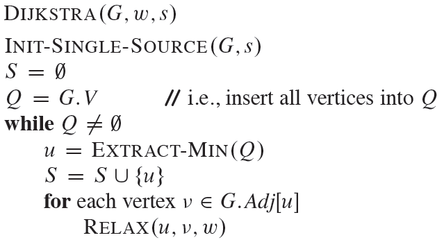

# 다익스트라 알고리즘(Dijkstra Algoritm)

### 개념

- **음의 가중치가 없는** 그래프에서 한 노드에서 다른 모든 노드까지의 최단거리를 구하는 알고리즘이다. 

- 방향그래프, 무방향 그래프 모두 가능

- BFS 기반

- 시간복잡도 : O(|V|^2) 

  > 우선순위 큐를 사용한 경우 시간복잡도 : O(ElogV) 

- 하나의 노드에서부터의 최단경로만 구할 수 있다

  >  [플로이드-워셜 알고리즘](https://namu.wiki/w/%ED%94%8C%EB%A1%9C%EC%9D%B4%EB%93%9C-%EC%9B%8C%EC%85%9C%20%EC%95%8C%EA%B3%A0%EB%A6%AC%EC%A6%98)은 가능한 모든 노드쌍들에 대한 최단거리를 구하는 알고리즘
  >
  >  [A* 알고리즘](https://namu.wiki/w/A*%20%EC%95%8C%EA%B3%A0%EB%A6%AC%EC%A6%98) : 다익스트라 알고리즘의 확장

- **가능한 적은 비용으로 가장 빠르게 해답에 도달하는 경로를 찾아내는 대부분의 문제에 응용**

  > ex. [루빅스 큐브](https://namu.wiki/w/%EB%A3%A8%EB%B9%85%EC%8A%A4%20%ED%81%90%EB%B8%8C), 내비게이션 두 도시를 잇는 가장 빠른 길,  [미로탐색 알고리즘](https://namu.wiki/w/%EB%AF%B8%EB%A1%9C%ED%83%90%EC%83%89%20%EC%95%8C%EA%B3%A0%EB%A6%AC%EC%A6%98), 라우팅의 OSPF 방식의 프로토콜

### 알고리즘

1. 우선 시작노드는 0으로 다른 모든 노드의 거리정보를 무한대(INF)로 초기화
2. 시작노드를 기준으로 BFS 시작
3. 다음 BFS 적용대상은 방문하지 않은 노드들 중 거리가 최소인 노드
4. 미방문" 상태인 모든 노드들 중, 출발점으로부터의 거리가 제일 짧은 짧은 노드 하나를 골라서 그 노드를 A에 저장
5. 계속 반복

### 의사코드

[출처](https://namu.wiki/w/%EB%8B%A4%EC%9D%B5%EC%8A%A4%ED%8A%B8%EB%9D%BC%20%EC%95%8C%EA%B3%A0%EB%A6%AC%EC%A6%98, https://ratsgo.github.io/data%20structure&algorithm/2017/11/26/dijkstra/)

